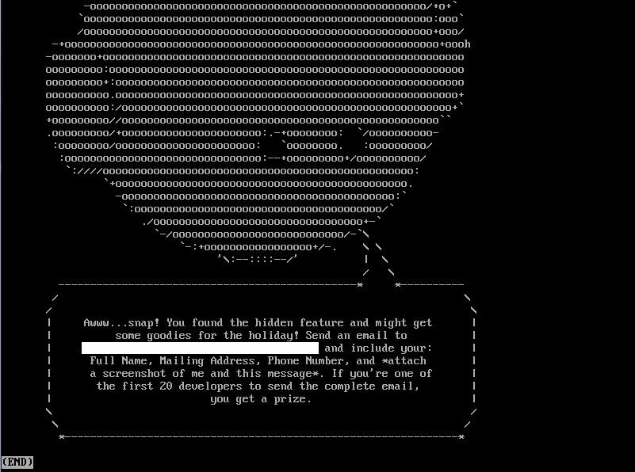

On March 9th, Ionic announced their [new beta and an easter egg hunt](http://blog.ionic.io/ionic-cli-v3-beta/). I didn't see it until the 13th and I love puzzles, so the hunt was on.

Step 1: Download and Unpack the beta
---------------------------------------------
I downloaded the new beta with `npm install -g ionic@beta` and extracted the source:

```bash
$ mkdir source && cd $_ && tar -zxvf /root/.npm/ionic/3.0.0-rc.2/package.tgz -C .
```

`mktemp -d` probably would have been a better option, but I didn't want to spend the time to look up the syntax to `cd` into the new `tmp` dir.

Also, I have the install location for `npm` packages on my system memorized because I have spent far too long troubleshooting them, but if you didn't you could find it with `npm root`.

Step 2: Pull the published Github code
-----------------------------------------------------

I took a bet here that paid off. Knowing how the Ionic team operates, I figured they wouldn't make it too easy and publish the easter egg in their public Github repo. 

At the time I just ran:

```bash
$ git clone https://github.com/ionic-team/ionic-cli.git
```
To replicate that now, you can download a commit from around that time. Here is random one:

```bash
$ git clone https://github.com/ionic-team/ionic-cli.git && cd ionic-cli && git reset --hard d076ac806378d874ea1075c4142350b73654d04c
```
Most of this time was spent finding the Github url.

Step 3: Compare the Github and NPM version source code
-------------------------------------------------------------------
Here I also made a bet that the easter egg would be under the main `ionic` package:

```bash
$ git diff --no-index source/package/ ionic-cli/packages/ionic | less
```
Hitting space as fast as I could, I noticed one change that looked interesting:

```bash
diff --git a/source/package/dist/commands/ionitron.ts b/ionic-cli/packages/ionic/src/commands/ionitron.ts
...
 +    let str = [
 +    '41 77 77 77 2e 2e 2e 73 6e 61 70 21 20 59 6f 75 20 66 6f 75 6e 64 20 74 68 65 20 68 69 64 64 65 6e 20 66 65 61 74 75 72 65 20 61 6e 64 20 6d 69 67 68 74 20 67 65 74',		
...
```

Now, I can't convert hexadecimal in my head on the fly, but I have participated in enough "[underhanded](https://codegolf.stackexchange.com/questions/tagged/underhanded)" coding challenges on [codegolf.stackexchange.com](https://codegolf.stackexchange.com/) back in the day to recognize an attempt at obfuscation. 

Sure enough, if I try `ionic ionitron`, I get the following: 

<p align="center">

</p>

Conclusion
----------
Hats off to the Ionic team for putting together a fun challenge, and I did end up getting a shirt out of it so I am happy:

<p align="center">

</p>