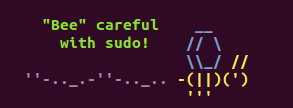

If you have used `sudo` on a new system, you have probably been greeted with this message:

```bash
$ sudo -i
We trust you have received the usual lecture from the local System
Administrator. It usually boils down to these three things:
    #1) Respect the privacy of others.
    #2) Think before you type.
    #3) With great power comes great responsibility.
```

This is `sudo`'s lecture prompt that typically runs the first time you use `sudo`, and although it is it has important information, it isn't very fun so we are going to customize it.

Preparing to change your lecture
--------------------------------
First you need to create your lecture prompt file (default of `/etc/sudoers.lecture`). This where your wildest ASCII dreams can come true.

Here is one I like to use:

<p align="center">
    
</p>

Which you can grab with this:

```bash
$ wget https://raw.githubusercontent.com/brianclemens/dotfiles/master/sudoers.lecture
```

Now you are ready to set the lecture prompt.

The Easy Way
------------
You can check if your system's `sudo` was built with the `--without-lecture` flag ([Ubuntu enables it](https://launchpad.net/ubuntu/quantal/+source/sudo/+changelog)),  with this command

```bash
$ sudo -V | grep without-lecture
```

If nothing is found, then the lecture prompt is easily changed:

 1. Edit the `sudoers` file with the `visudo` command.
 2. Add the following lines into the Defaults section:


    ```bash
    Defaults    lecture = always
    Defaults    lecture_file = /path/to/file
    ```

	Change the path to your new `lecture_file` from the first section.

Congrats! Your artwork will be displayed on every `sudo` password prompt. Now you can focus on spreading your ASCII brilliance to MOTD, `sudo`'s [insults](https://grayson.sh/blog/viewing-and-creating-custom-insults-for-sudo), or even your Bash prompt.

The Hard Way
------------
Assuming your `sudo` was built with `--without-lecture`, then your quest for impressing other Unix nerds and avoiding actual work just got a little harder. But you are already in this deep, aren't you?

To rebuild `sudo` without the `--without-lecture` flag:

 1. Copy out your current `sudo` build configuration:


    ```bash
    $ sudo -V | sed -n -e 's/  --without-lecture //g; s/^.*Configure options: //p' | tee sudo.options
    ```

 2. Grab the `sudo` source and build it

    ```bash
    $ apt-get source sudo
    $ cd sudo*
    $ ./configure $(< sudo.options)
    $ make
    $ make install
    ```
 3. Follow the steps from the Easy Method above to finish the process.

 Now you can re-alias your new `sudo` and proudly display your work!

The Hardest Way
---------------
If you read the above method and scoffed at my lavish wasting of tens of kilobytes, then this method is for you.

Since you have to rebuild `sudo` anyway, you can override the default lecture with your own in the source and avoid a separate file altogether:

 1. Grab the `sudo` source:

    ```bash
    $ apt-get source sudo
    $ cd sudo*
    ```

 2. Edit the file containing the default lecture prompt. (Hint: `grep -nR lecture .`)(Further hint: `plugins/sudoers/check.c`)
 3. Change the following block to your desired message:

    ```c
     #define DEFAULT_LECTURE "\n" \
        "We trust you have received the usual lecture from the local System\n" \
        "Administrator. It usually boils down to these three things:\n\n" \
        "    #1) Respect the privacy of others.\n" \
        "    #2) Think before you type.\n" \
        "    #3) With great power comes great responsibility.\n\n"
    ```

 4. Make `sudo`

    ```bash
    $ make
    $ make install
    ```

Voilà! You are ready to take some nice screenshots of your terminal!