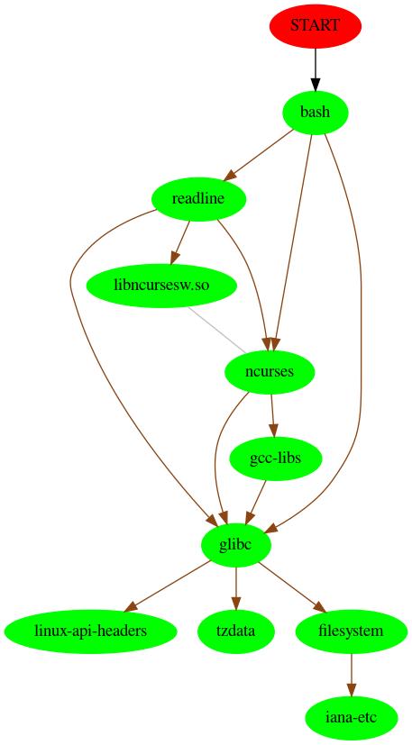

While learning more about [`pacman`](https://www.archlinux.org/pacman/pacman.8.html), I found the [`pactree`](https://www.archlinux.org/pacman/pactree.8.html) command.

Here is a quick description:

> pactree - package dependency tree viewer
>
> Pactree produces a dependency tree for a package.

What really interested me though was the `-g` switch:

> -g, --graph
>
> Generate a Graphviz description. If this option is given, the --color and --linear options are ignored.

I like this because now I can use it to generate dependency graphs with [`GraphViz`](https://linux.die.net/man/3/graphviz).

First Example:
---------------------

Here is an example dependency graph for `bash`:

```bash
$ pactree -g bash | dot -T png > bash.png
```

Which generates this picture:

<p align="center">
    
</p>

This can be used on any package and there are several different output formats (`man dot` for more).

Reverse it
--------------

Another interesting option is to reverse the output:

> -r, --reverse
>
> Show packages that depend on the named package

I'm sure there is a better way or a `pacman` option I don't know of, but here is a dirty script to find the most relied on package:

```bash
$ pacman -Q | cut -f 1 -d " " | xargs -I % sh -c 'pactree -r -u % | echo "$(wc -l) %";' | sort -nr
393 iana-etc
392 tzdata
392 linux-api-headers
392 filesystem
391 glibc
267 gcc-libs
249 ncurses
243 readline
240 bash
180 zlib
#### Continues for 460 lines ####
```

> **Note:** We are just using `pacman` to display all packages, passing it to `pactree` to display all the packages that depend on it, then parsing out to a sorted list.

It looks like [`iana-etc`](https://www.archlinux.org/packages/core/any/iana-etc/) is the most depended on package in my system, so let's see what that graph looks like:

```bash
$ pactree -gr iana-etc | dot -T png > iana.png
```

Which generates a huge 11.5 MB, 22,805px x 2,267px image, but I won't embed it here to save people's data usage. <a href="../assets/images/iana.png">Click here to see the full craziness.</a>


Conclusion
---------------

I am not too sure of the practical uses for this, but it is very fun to quickly visualize the web of how packages depend on each other. Maybe a new project is to graph all the core packages on one picture?